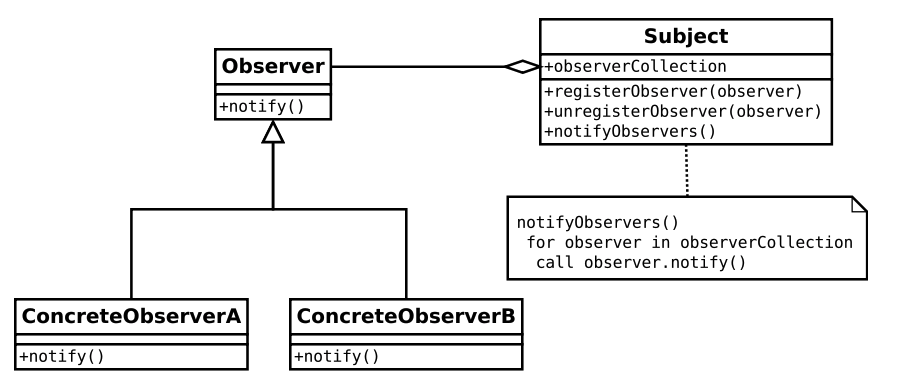

## Reactive Programming

리액티브 프로그래밍은 데이터 흐름과 전달에 관한 프로그래밍 패러다임이다. 기존의 명령형 프로그래밍은 주로 컴퓨터 하드웨를 대상으로 프로그래머가 작성한 코드가 정해진 절차에 따라 순서대로 실행된다. 그러나 리액티브 프로그래밍은 데이터 흐름을 먼저 정의하고 데이터가 변경되었을때 연관되는 함수나 수식이 업데이트되는 방식이다.

ex) 엑셀을 사용해 연간 매출액을 계산하기 위해서는 월 매출액을 합산해야 한다. 만약 최종 매출액에서 2월은 -200 6월은 +400으로 데이터가 변경되었다면 데이터 소스(월 매출액)로부터 변경된 금액을 전달받아 정해진 수식을 통해 합산액을 구하는 방식이 바로 리액티브 프로그래밍이다. 다시 말해 데이터의 변화가 발생했을 때 변경이 발생한 곳에서 새로운 데이터를 보내(push)준다. 명령형 방식은 변경된 매출액을 다시 가져와서 구하는 방식이다. 

### 자바 언어와 리액티브 프로그래밍 

흔히 알고있는 콜백이나 옵서버 패턴을 넘어서 RxJava 기반의 리액티브 프로그래밍이 되려면 **함수형 프로그래밍** 이 필요하다. 함수형 프로그래밍은 side effect가 없으므로 멀티 스레드 환경에서도 안전하다. 

애플리케이션 개발 환경에서 리액티브 프로그래밍을 하기 위해선 기반 시설이 필요하다. 즉, 데이터 소스를 정의할 수 있고, 그것의 변경 사항을 받아서 프로그램에 알려줄 수 있는 존재가 필요하다. 그것을 .NET환경에서는 리액티브 확장(Reactive Extension), JVM위의 자바 언어로 구현한 라이브러리가 RxJava이다. 

### RxJava를 만들게 된 이유

2013년 2월 넷플릭스 기술 블로그에서 처음 RxJava가 공개되었다. .NET환경의 Reactivce Extenstion 라이브러리를 JVM에 포팅하여 RxJava를 만들었으며 만들게 된 세가지 핵심 이유는 다음과 같다

- 동시성을 적극적으로 끌어안을 필요가 있다.

	자바가 동시성을 처리하는 데 번거로움이 있었으므로, 클라이언트 요청을 처리하는 서비스 계층에서 동시성을 적극 활용하였다. 요청을 처리할 때 다수의 비동기 실행 흐름을 생성하고, 결과를 취합하여 최종 리턴하는 방식으로 개선하였다.

	- 동시성(Concurrency) : 싱글 코어에서(멀티 코어도 가능) 멀티 쓰레드를 동작하기 위한 방식으로 멀티 태스킹을 위해 여러 개의 스레드가 번걸아가면서 실행되므로 마치 동시에 실행 되는것처럼 보이는 방식을 말한다. 
	- 비동기(Asynchronous) : 프로그램의 주 실행 부분이 멈추어서 기다리는 부분 없이 다로 다음 코드가 실행이 되는 방식을 말한다. 
	- 병렬성(Parallelism) : 물리적으로 멀티 코어 환경에서 멀티 쓰레드로 동시에 여러 프로그램을 실행하는것을 말한다.

- 자바 Future을 조합하기 어렵다는 점을 해결해야 한다.

	당시 자바8에서 제공하는 CompletableFuture같은 클래스가 제공되지 않았다. 그래서 비동기 흐름을 조합할 수 있는 방법이 없었으므로, RxJava에서는 비동기 흐름을 조합할 수 있는 실행단위(리액티브 연산자)를 제공한다. 

- 콜백 방식의 문제점을 개선해야 한다.

	콜백이 콜백을 부르는 콜백 지옥(Callback Hell)이 코드의 가독성을 떨어뜨리고 문제 발생시 디버깅을 어렵게 하기 때문이다. 

리액티브 프로그래밍은 비동기 연산을 필터링, 변환, 조합하여 세 가지 핵심 이유를 해결할 수 있다. -> RxJava는 Observable과 같은 데이터 소스와 map(), filter(), reduce() 와 같은 연산자를 제공한다. 

### 마블 다이어그램 

- 위에 있는 실선은 Observable의 시간 표시줄 (timeline)이다. 시간순으로 데이터가 발행되는 것을 표현한다.
- 실선 위의 도형들은 **Observable에서 발행하는 데이터**이다. 데이터를 발행할 때는 onNext 콜백이 발생한다.
- 실선위의 수직선은 파이프이며, Observable에서 데이터 발행을 **완료했다는 의미이다**. 한번 완료하면 더 이상 데이터를 발행할 수 없다. 완료하면 onComplete 알림이 발생한다. 
- 아래로 내려오는 점선 화살표는 각각 **함수의 입력과 출력 데이터**이고, 가운데 박스는 함수를 의미한다. 여기서 filp함수는 입력값을 뒤집는 함수이다
- 밑의 실선은 **함수의 결과가 출력된 시간 표시줄**이다. 만약 예기치 못한 에러 발생으로 종료된다면, X 로 대체되고 onError 알림이 발생한다.

### 옵서버 패턴(Observer Pattern)

옵서버 패턴은 객체의 상태 변화를 관찰하는 관찰자들, 즉 옵서버들의 목록을 객체에 등록하여 상태 변화가 있을 때마다 메서드 등을 통해 객체가 직접 목록의 각 옵서버에게 통지하도록 하는 디자인 패턴이다. 주로 분산 이벤트 핸들링 시스템을 구현하는데 사용되고, 구독/발행 모델로도 알려져 있다.

- 옵서버 패턴의 핵심은 옵서버 또는 리스너라 불리는 하나 이상의 객체를 관찰 대상이 되는 객체에 등록시킨다. (registerObserver)

- 각각의 옵저버들은 관찰 대상인 객체가 발생시키는 이벤트를 받아 처리한다. (notify) 위 그림의 UML에서 관찰 대상인 객체는 '이벤트를 발생시키는 주체' 라는 의미에서 Subject로 표시된고 있다. 

- 이벤트가 발생하면 각 옵저버는 콜백을 받는다. Nofity 함수는 관찰 대상이 발행한 메세지 이외에, 옵서버 자신이 생성한 인자값을 전달할 수도 있다. 각 파생 옵서버는 notify함수를 구현함으로써 이벤트가 발생했을 때 처리할 각자의 동작을 정의해야 한다.

#### 참고 

- How to use RxJava https://github.com/ReactiveX/RxJava/blob/2.x/docs/How-To-Use-RxJava.md

- RxAndroid https://github.com/ReactiveX/RxAndroid

- Subscribe [http://reactivex.io/documentation/operators/subscribe.html](http://reactivex.io/documentation/operators/subscribe.html)

- RxJava 프로그래밍 [http://www.yes24.com/Product/Goods/45506284?scode=032&OzSrank=2](http://www.yes24.com/Product/Goods/45506284?scode=032&OzSrank=2)
